# CloudBid — Cloud-Native Auction Platform Final Report

**ECE1779 Introduction to Cloud Computing W2026 | Group 2**

## Team Information

| Name | Student Number | Email |
|------|---------------|-------|
| Jingxian Hou | 1001159710 | jingxian.hou@mail.utoronto.ca |
| Felipe Solano | 1002752032 | felipe.solano@mail.utoronto.ca |

## Motivation

Our team built **CloudBid**, a stateful auction platform for short, flash-sale style auctions. Our main goal was to build a system that can handle bidding correctly when many users act at the same time. We chose this project because auctions are a good example of a system where correctness matters. During a live auction, several users may place bids within seconds of each other, and the system still needs to track one valid highest bid and one correct winner. If the system does not manage state carefully, it can produce the wrong winner or an inconsistent bid history.

Our system also includes a follower feature allowing users to follow sellers such as popular creators or artists. When a well-known seller starts an auction, that can cause a sudden increase in traffic and bidding activity. This made the project a good fit for studying safe bidding under concurrency and correct state handling.

Our target users are small merchants, independent creators, and craft sellers who want a simple way to run short, time-boxed auctions without relying on a large or complex marketplace platform. Building this project gave us the opportunity to tackle real-world challenges in data consistency, persistent PostgreSQL storage, Kubernetes-based orchestration, monitoring, and backup and recovery in one system which are all directly aligned with the course objectives


## Objectives

The main objective was to design and deploy a stateful cloud-native auction platform that:

- Supports user registration, JWT-based authentication, profile management, and seller-follower relationships
- Allows users to create, browse, edit, and cancel auctions (including private auctions visible only to followers)
- Ensures bidding correctness under concurrent access using PostgreSQL transactions and row-level locking
- Uses a long-running background worker that monitors the life cycle of each auction, assigns winners for completed auctions, and integrates with a third-party application to send out email notifications
- Persists all application data in PostgreSQL with durable storage. The database snapshots will be backed up in DigitalOcean Spaces and allow developers to easily recover the database
- Deploys on DigitalOcean Kubernetes with rolling updates, health probes, and autoscaling
- Includes operational features: CI/CD pipeline through github action and terraform, monitoring with Prometheus-style metrics, automated database backup/recovery, and email notifications

## Technical Stack

| Layer | Technology |
|-------|-----------|
| **Frontend** | Static HTML, CSS, JavaScript (served by Express) with Chart.js for monitoring dashboards |
| **Backend** | Node.js with Express |
| **Database** | PostgreSQL 15 (Alpine) |
| **Authentication** | JWT (jsonwebtoken) + bcrypt for password hashing |
| **Email Notifications** | Resend API |
| **Monitoring** | prom-client (Prometheus metrics), custom `/metrics` endpoint, Chart.js dashboards |
| **Containerization** | Docker, Docker Compose (local development) |
| **Orchestration** | Kubernetes (DigitalOcean Managed Kubernetes) |
| **Infrastructure Provisioning** | Terraform (DigitalOcean provider) |
| **CI/CD** | GitHub Actions |
| **Backup Storage** | DigitalOcean Spaces (S3-compatible object storage) |
| **Container Registry** | Docker Hub |

### Orchestration Approach: Kubernetes

We chose Kubernetes over Docker Swarm because Kubernetes is the industry standard for container orchestration and provides mature lifecycle management features. Our Kubernetes deployment includes:

- **API Deployment** with 2 replicas, rolling update strategy, liveness/readiness probes, and a Horizontal Pod Autoscaler (HPA) scaling from 2–6 replicas at 70% CPU
- **PostgreSQL StatefulSet** with a PersistentVolumeClaim backed by DigitalOcean Block Storage for data durability across pod restarts
- **Worker Deployment** — The worker pod monitors the life cycle of each auction; it is a long-running worker that performs a scan on active auctions
- **Cron Job** — The cron job is triggered by Kubernetes every day at midnight. It takes a snapshot of the PostgreSQL database and uploads the snapshot to DigitalOcean Spaces
- **Kubernetes Secrets** — These store database credentials, JWT secret, and email API keys


## Features

### Core Features

1. **User Accounts** — Users can register an account with a username, password, and email address that is used for notifications. We are using JWT-based authentication. Passwords are hashed with bcrypt (10 salt rounds). In addition, users can follow other users to join private auctions.

2. **Auction Management** — Authenticated users can create auctions with a title, description, starting price, and end time. Auctions can be edited (if no bids exist for price changes) or cancelled by the creator. Auctions support a **private mode** visible only to the creator's followers.

3. **Concurrent Bidding** — Bids are placed within a PostgreSQL transaction using `SELECT ... FOR UPDATE` row-level locking on the auction row. This prevents race conditions and ensures only one valid highest bid exists at any time. The server timestamp is the source of truth for auction expiration. Bids below the current highest or on expired/inactive auctions are rejected.

4. **Background Worker** — A dedicated worker container polls for completed auctions, determines winners, updates auction status, and sends email notifications. This is done through a third-party email service provider called Resend. It uses `FOR UPDATE SKIP LOCKED` to safely process auctions without conflicting with the API server. The transactional outbox pattern is used for reliable email delivery tracking.

5. **Follow/Unfollow System** — Users can follow other users. Private auctions are only visible to followers of the creator. Access control is enforced on all auction views and bid placements. This is the core feature that makes our platform different from any other auction website

### Advanced Features

6. **CI/CD Pipeline (GitHub Actions)** — We achieve CI/CD with GitHub Actions and Terraform scripts to provision our infrastructure. Every time a feature branch is merged to `main`, the pipeline performs the following steps to deploy the application to production:
   - Runs Terraform to ensure infrastructure is up to date (cluster, Spaces bucket, monitoring alerts)
   - Builds and pushes the Docker image to Docker Hub
   - Deploys to Kubernetes by applying manifests, running schema migrations, and restarting deployments
   - Verifies rollout status with `kubectl rollout status` (300s timeout)

7. **Backup and Recovery** — A Kubernetes CronJob runs daily `pg_dump` backups and uploads them to DigitalOcean Spaces, this job runs every day at midnight to generate the snapshot. The recovery process is purely manual; this is by design to avoid the system accidentally overwriting production data when there is a false alert.  A separate restore Job (`restore-job.yaml`) can restore the database from the latest backup in the bucket. The restore process drops and recreates the schema, then replays the SQL dump.

8. **Email Notifications (Resend)** — The platform sends emails for:
   - New bids on an auction (notifies the seller)
   - Auction completion (notifies winner, seller, and all losing bidders)
   - Auction expiration with no bids (notifies the seller)
   
   Email credentials are stored in Kubernetes Secrets. Notifications are sent after the database transaction commits to ensure consistency.

9. **Monitoring Dashboard** — The app exposes a Prometheus-compatible `/metrics` endpoint tracking:
   - HTTP request counts and durations (by method, route, status code)
   - Active auction count
   - Node.js process metrics (CPU, memory, event loop lag)
   
   The frontend includes a real-time monitoring tab with metric cards, latency breakdowns by route, and live-updating Chart.js graphs for memory, event loop P99, request counters, and per-route latency.

10. **Infrastructure Monitoring Alerts** — We use Terraform to provision DigitalOcean monitoring alerts for CPU > 80%, memory > 80%, and disk > 80% on cluster nodes, with email notifications.

11. **Horizontal Pod Autoscaler** — The API deployment scales automatically between 2 and 6 replicas based on CPU utilization (target: 70%).

## User Guide

This section explains how to use the main features through the web interface.

### 1. Register and Log In

New users can create an account from the home page. Existing users can log in with their username and password.

Steps:
1. Open the application in your browser.
2. In the **Register** box, enter a username, email, and password, then click **Register**.
3. After registering, use the **Login** box to sign in.
4. Once logged in, the navigation bar shows the current username and the main application tabs.

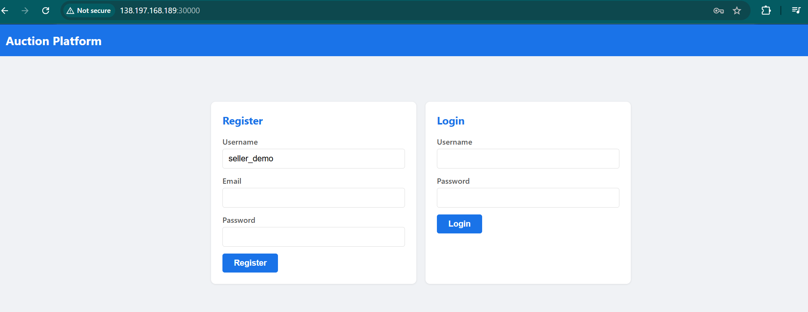

### 2. Create an Auction

Authenticated users can create a new auction.

Steps:
1. Open the **Create Auction** tab.
2. Enter the auction title, description, starting price, and end time.
3. Click **Create Auction**.
4. The new auction appears in the auction list and in **My Auctions**.

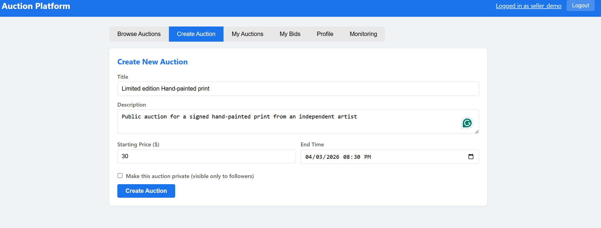
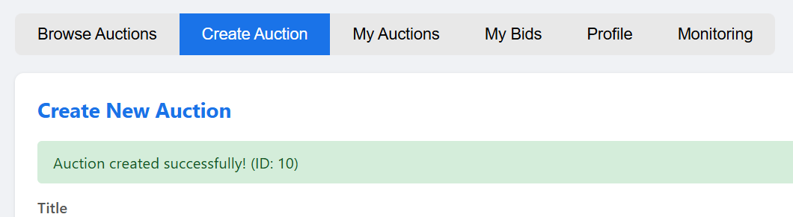

### 3. Create a Private Auction

Users can create a private auction that is visible only to followers of the seller.

Steps:
1. Open the **Create Auction** tab.
2. Fill in the auction details.
3. Check **Make this auction private**.
4. Click **Create Auction**.

Private auctions are shown with a **Private** badge in the interface.

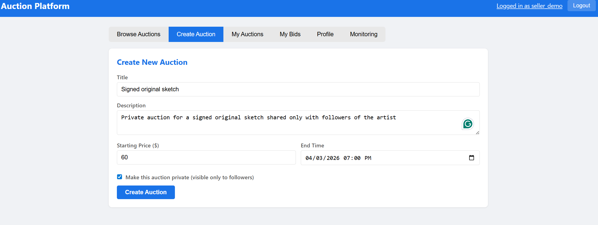

### 4. Follow or Unfollow a Seller

Users can follow another seller to gain access to that seller’s private auctions.

Steps:
1. Open an auction created by another user.
2. On the auction detail page, click **Follow Seller**.
3. After following, private auctions from that seller become visible to your account.
4. To remove that access, click **Unfollow Seller**.

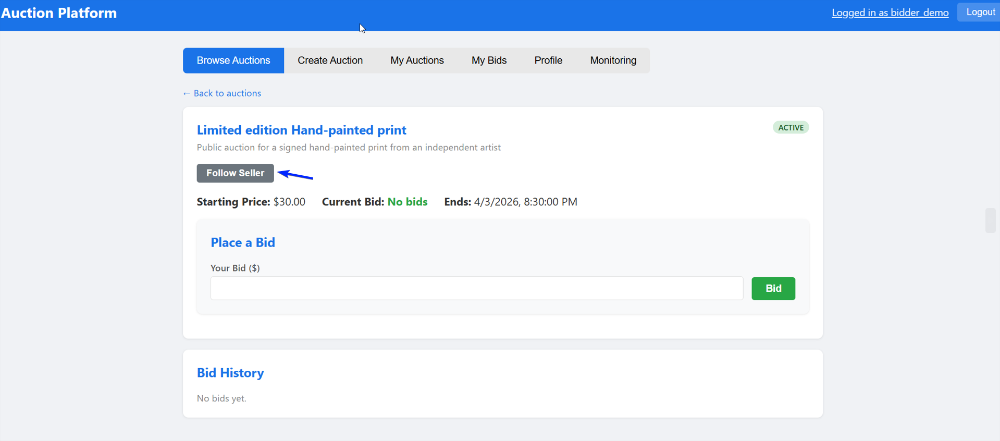
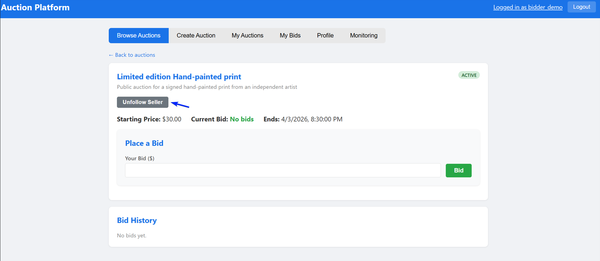

### 5. Browse Auctions

Users can browse auctions from the **Browse Auctions** tab.

Steps:
1. Open the **Browse Auctions** tab.
2. Use the search bar to search by title.
3. Use the status filter to view active or completed auctions.
4. Click an auction card to open its details.

Public auctions are visible to all users. Private auctions are visible only to the seller and users who follow that seller.

**Before following the seller:**

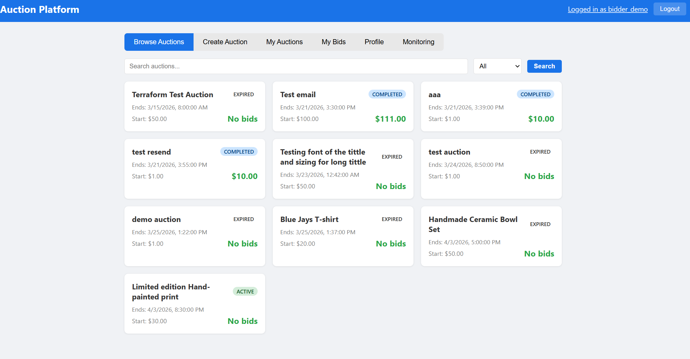

**After following the seller:**

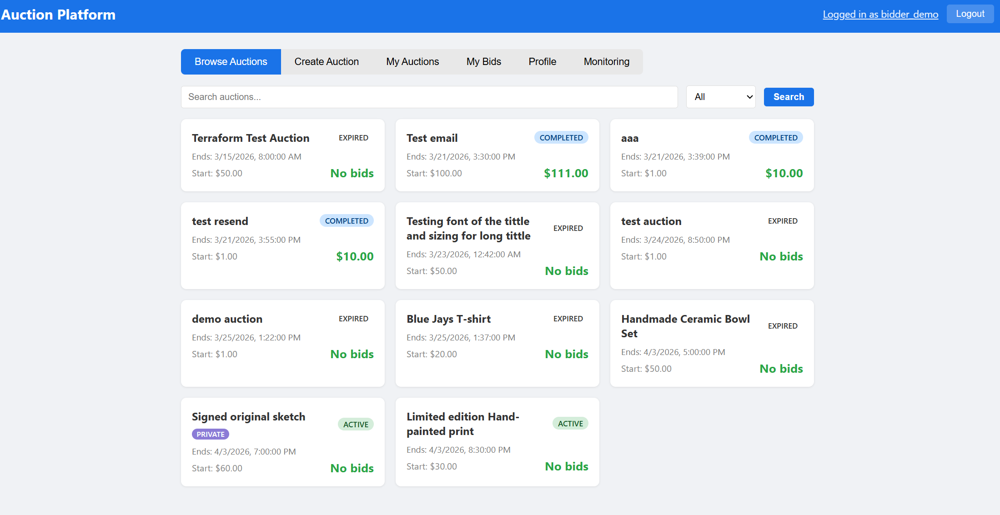


### 6. View an Auction and Place a Bid

Users can open an auction to view details and place bids.

Steps:
1. Click an auction from the browse page.
2. Review the title, description, starting price, current highest bid, and end time.
3. Enter a bid amount and click **Bid**

The system only accepts bids that are higher than the current highest bid. Sellers cannot bid on their own auctions. Private auction bidding is limited to authorized users.

If multiple bids arrive close together, the backend processes them safely so that only one correct highest bid is recorded.

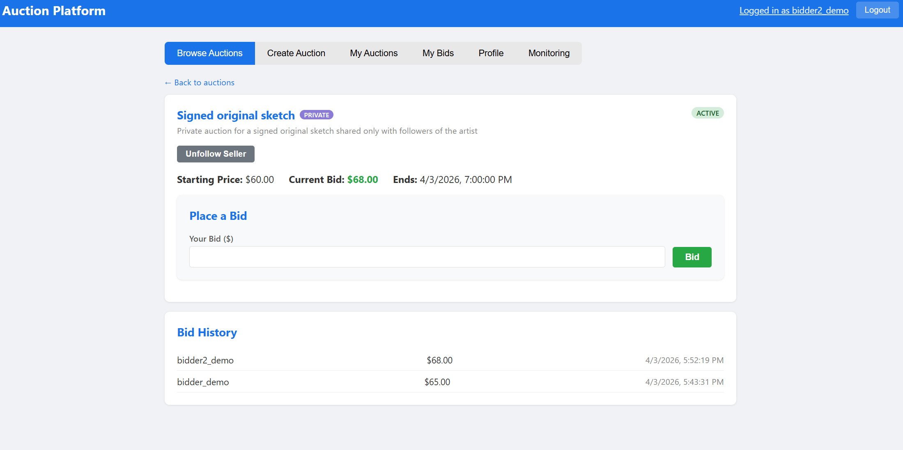

### 7. Email Notifications

The auction owner and the winner receive a system-generated email notification when the auction is completed. After the auction end time, a background worker updates the final auction status and sends the related notifications automatically.

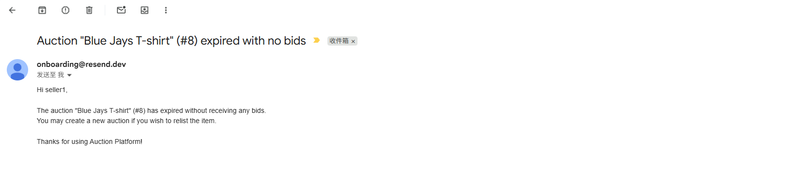

### 8. View My Auctions

The **My Auctions** tab shows all auctions created by the logged-in user.

Steps:
1. Open the **My Auctions** tab.
2. Review created auctions, their status, and the current highest bid.
3. Open an auction to view details and seller actions.

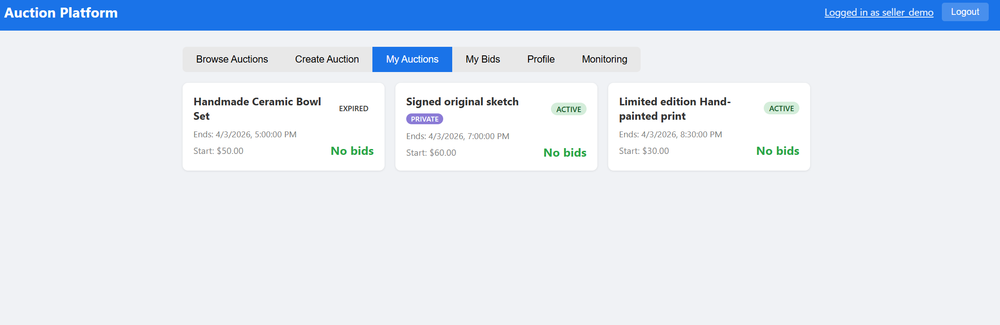

### 9. View My Bids

The **My Bids** tab shows the user’s bidding history.

Steps:
1. Open the **My Bids** tab.
2. Review each bid, the related auction, the auction status, and whether the bid is currently **Winning** or **Outbid**.
3. Click a row to reopen the related auction page.

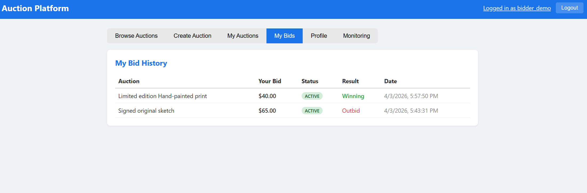

### 10. Update Profile

Users can update their email address from the **Profile** tab.

Steps:
1. Open the **Profile** tab.
2. Update the email field.
3. Click **Update Email**.

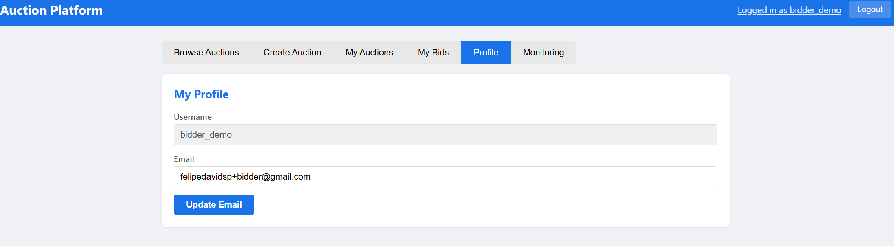

### 11. View Monitoring Metrics

The **Monitoring** tab displays application metrics collected from the `/metrics` endpoint.

Steps:
1. Open the **Monitoring** tab.
2. Review summary cards, charts, and raw metrics output.
3. Use this page to observe request activity, latency, memory usage, and active auction counts.

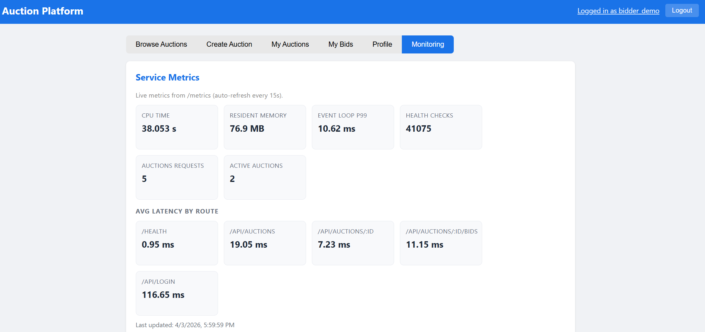
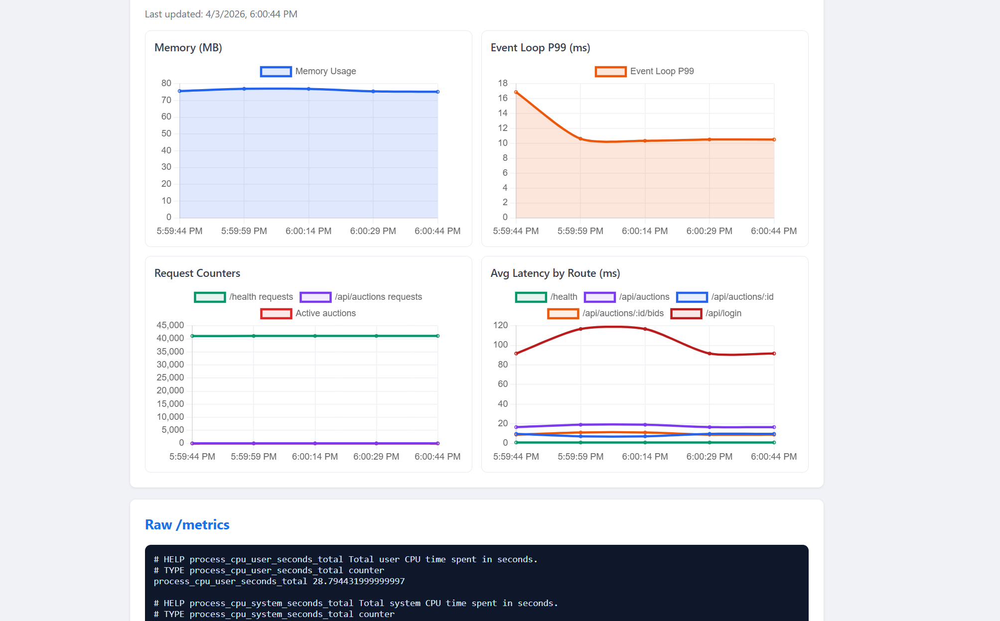

## Development Guide

This section explains how to set up the project for local development and testing.

### Prerequisites

- Docker
- Docker Compose
- Node.js (optional for local inspection, but Docker Compose is the main development path)

Docker Compose is the main local development workflow for this project

### Environment Configuration

Create a `.env` file in the project root with the required environment variables:

```env
POSTGRES_USER=postgres
POSTGRES_PASSWORD=your_postgres_password
POSTGRES_DB=auctiondb
JWT_SECRET=your_jwt_secret
RESEND_API_KEY=your_resend_api_key
EMAIL_FROM=your_verified_sender_email
WORKER_INTERVAL_MS=30000
```

These variables are used by the API, worker, and database services.

### Local Architecture

The local setup runs three services through Docker Compose:

- **api**: the Node.js/Express backend, available on port `3000`
- **worker**: the background worker for auction lifecycle processing
- **db**: the PostgreSQL database, available on port `5432`

### Database Initialization and Storage

The PostgreSQL container loads the schema automatically from `init.sql` when the database starts for the first time.

A named Docker volume is used to keep database data between container restarts.

### Start the Application

From the project root, run:

```bash
docker-compose up --build
```
This starts:

- the API at `http://localhost:3000`
- the PostgreSQL database at `localhost:5432`
- the worker service

### Local Testing

After the containers start:

1. Open `http://localhost:3000` in a browser.
2. Register a user and log in.
3. Create a public or private auction.
4. Use a second account to test following and bidding flows.
5. Open the `Monitoring` tab to inspect metrics from `/metrics`.

### Stop the Application

To stop the local services:

```bash
docker-compose down
```
To stop the services and remove the database volume:

```bash
docker-compose down -v
```

### Notes
- Email notifications require valid Resend credentials.
- If the database volume already exists, changes in `init.sql` will not be applied automatically unless the volume is removed and recreated.

## Deployment Information

The live version of the Platform is available at: `http://138.197.168.189:30000/`

The application is deployed on DigitalOcean Kubernetes. The deployment includes the API service, worker service, and PostgreSQL database, with persistent storage for database state and supporting cloud infrastructure for monitoring and backup.

## AI Assistance & Verification

AI was used mainly for brainstorming, debugging assistance, verification, and writing refinement. 

Its most meaningful contributions were:

- Helping us compare feature options and keep the project scope manageable. At the beginning, we wanted to build this project with a Large Language Model with a RAG framework that could give end users recommendations with historical data. However, after brainstorming with AI, we quickly realized that it would be impossible to complete within a month for two developers. It was also not aligned with the project requirements. So we decided to drop the LLM feature, stick with basic functionality, and shift our focus to infrastructure management with Kubernetes and Docker.
- We also used AI to generate basic boilerplate code, as it is an industry standard tool. We used AI to generate a basic CRUD API template, and we provided the implementation based on how we wanted the APIs to work.
- We also utilized AI in our debugging process. We hit a major roadblock when we were implementing the GitHub Actions CI/CD functionality. We were hardcoding some of the credentials in Terraform variables, and it was blocked by GitHub. AI suggested moving all our credentials to GitHub variables so that GitHub Actions could easily fetch them through
`${{ secrets.DIGITALOCEAN_TOKEN }}`. This provides a much safer way to store secrets.
- In addition, we wanted to have the full CI/CD experience, not just CI/CD on the API. We wanted GitHub Actions to be able to deploy the whole infrastructure change. After talking to AI, we realized that Terraform is one of the most common tools for provisioning cloud infrastructure. So that is also one of the reasons why we chose Terraform.

The team critically evaluated AI output before using it. Some AI suggestions were useful as starting points, but others were too broad, not fully applicable to our project, or needed correction after checking the real codebase and repository history. One representative example is documented in `ai-session.md`.

### Verification Process

All AI-assisted output was reviewed by the team before being used in the project. In particular:

- Manual testing of the implemented features through the web interface and API
- Inspection of backend code, route behavior, and database-related logic
- Checking using logs, metrics, and deployment artifacts where appropriate

The final design decisions, implementation choices, and documentation remain the responsibility of the team.

## Individual Contributions

### Jingxian Hou

- Designed and implemented major parts of the core backend API, including auction CRUD and concurrency-safe bid placement
- Led the PostgreSQL schema design and maintained related database/infrastructure updates
- Configured Kubernetes deployment manifests (`k8s-deploy.yaml`): StatefulSet, Deployments, PVC, HPA, health probes
- Set up Terraform for infrastructure provisioning and monitoring alerts
- Implemented the backup CronJob and restore Job for database recovery
- Built the frontend UI (`index.html`) with monitoring dashboard and Chart.js integration
- Designed and implemented the CI/CD pipeline with GitHub Actions (`deploy.yml`)
- Integrated the Resend email service for winner, seller, loser, and expiration notifications
- Contributed to the final report and project documentation

### Felipe Solano

- Implemented authentication flows, including user registration, login, password hashing with bcrypt, and JWT-based route protection
- Implemented authenticated user API endpoints for profile, My Auctions, and My Bids views
- Contributed to the database schema in (`init.sql`), including the private-auction flag, follower relationships, and related schema fixes
- Implemented the private auctions feature across schema, backend, and frontend
- Added follow/unfollow functionality and related authorization helpers for follower-based private auction access control
- Implemented private auction visibility restrictions in listing, detail, bid history, and bidding flows
- Added logic for user bids and updated the UI to show Winning/Outbid status
- Fixed frontend refresh and state issues for login/logout and user-specific views
- Performed backup/recovery testing and validation
- Contributed to testing, demo preparation, and technical documentation for the final submission

## Lessons Learned and Concluding Remarks

This project gave us practical experience building a stateful cloud application where correctness, persistence, and deployment behavior all mattered at the same time.

One of our main lessons was the value of correct state handling. In this project, bids could happen close together, auctions could end at any time, and the system had to keep one correct result. That forced us to think carefully about database transactions, locking, worker logic, and persistent storage.

We also learned that good scope control matters. It was easy to think of more features, but a smaller and clearer scope helped us finish a stronger project. We focused on the parts that matched the course goals most closely: safe bidding, persistent PostgreSQL storage, Kubernetes deployment, monitoring, backup and recovery, and a simple user flow.

This project also gave us experience across the full stack. We worked on the API, the database, the frontend, Docker, Kubernetes, and cloud deployment. That helped us see how each part affects the others.

In the end, this project helped us understand how to build a cloud application that is correct, persistent, and easier to test and explain. It showed us the value of keeping the design simple, checking our work carefully, and staying within scope.

## Video Demo

The final project demo video is available at the following link:

[Demo video](https://youtu.be/9Q86gTZ0xZM)

Direct URL: `https://youtu.be/9Q86gTZ0xZM`
